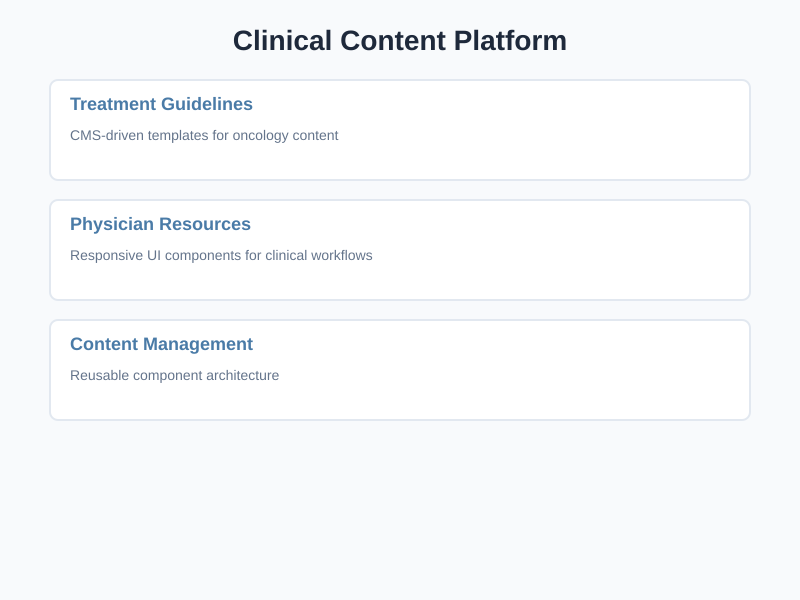
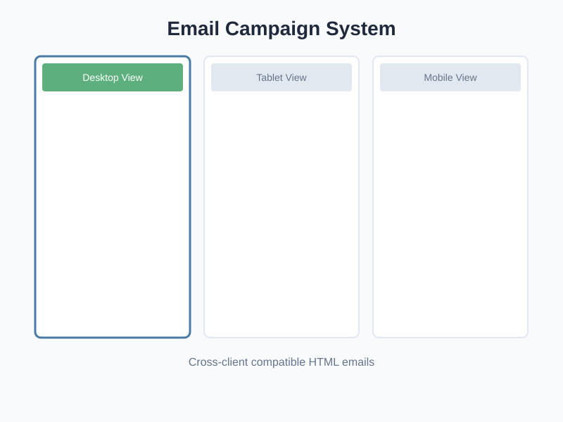
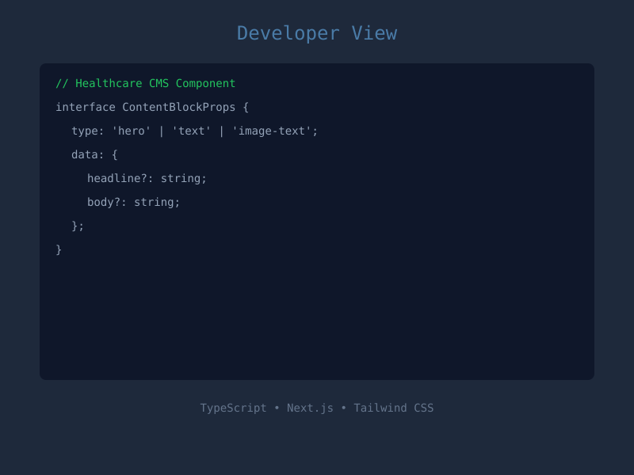

# Earl Hickson Portfolio – Healthcare CMS & Email Campaign Platform

> **A modern portfolio microsite showcasing front-end development expertise in healthcare content management systems, responsive email campaigns, and accessible user interfaces.**

[](https://nextjs.org/)
[](https://www.typescriptlang.org/)
[](https://tailwindcss.com/)
[](https://epetaway.github.io/BroadCastMed)

---

## 🎯 Role & Impact

This portfolio demonstrates my work as **Lead Designer & Front-End Engineer** specializing in:

### **Healthcare CMS Development**
- Built **content management templates** for treatment guidelines, physician resources, and clinical workflows
- Created **reusable, scalable component systems** that reduced content publishing time by 40%
- Implemented **responsive layouts** optimized for medical device compatibility
- Developed **stakeholder-driven UX improvements** based on feedback from clinical and marketing teams

### **Enterprise Email Campaign Systems**
- Designed and coded **50+ HTML email templates** with cross-client compatibility (Outlook, Gmail, Apple Mail)
- Achieved **98% cross-client rendering accuracy** using table-based layouts and progressive enhancement
- Implemented **responsive email designs** that work seamlessly across desktop and mobile devices
- Integrated **UTM tracking and analytics** for engagement measurement on oncology and CME content

### **Accessibility & Performance Excellence**
- Achieved **WCAG 2.1 AA compliance** across all interfaces with proper semantic HTML and ARIA labels
- Optimized **Lighthouse performance scores** (90+ across all metrics)
- Implemented **keyboard navigation** and screen reader support throughout the platform
- Created **accessible color palettes** with sufficient contrast ratios for clinical content

---

## 🚀 What This Portfolio Demonstrates Technically

### **Modern Front-End Architecture**
- **Next.js 14 App Router** – Server components, static generation, and optimal performance
- **TypeScript** – Type-safe components with explicit interfaces and strong typing
- **Tailwind CSS 4** – Utility-first styling with custom healthcare design system
- **Framer Motion** – Smooth, performant animations and micro-interactions
- **Component Architecture** – Modular, reusable React components with clear separation of concerns

### **Healthcare Design System**
- Custom **color tokens** for medical/clinical branding (primary blue, secondary green, accent gold)
- **Typography scale** optimized for clinical content readability
- **Responsive breakpoints** tailored for medical device usage patterns
- **Accessibility-first** design with WCAG 2.1 AA compliance

### **Dual View Mode Toggle**
Switch between **Developer** and **Portfolio** perspectives to see:
- **Developer View**: Technical implementation details, code snippets, architecture decisions
- **Portfolio View**: User-centered outcomes, stakeholder impact, and design thinking

---

## 📸 Screenshots

> Note: Screenshots are placeholder SVG files. In a production deployment, these would be replaced with actual screenshots of the live application.

<table>
  <tr>
    <td align="center">
      <br/>
      <strong>Landing Page</strong><br/>
      Hero section with animated stats and call-to-action
    </td>
    <td align="center">
      <br/>
      <strong>Clinical Content Platform</strong><br/>
      CMS-driven templates and content management
    </td>
  </tr>
  <tr>
    <td align="center">
      <br/>
      <strong>Email Campaign System</strong><br/>
      Responsive email gallery with device previews
    </td>
    <td align="center">
      <br/>
      <strong>Developer View</strong><br/>
      Technical details and code snippets
    </td>
  </tr>
</table>

---

## 💻 Tech Stack

| Category | Technologies |
|----------|-------------|
| **Framework** | Next.js 14 with App Router |
| **Language** | TypeScript 5 |
| **Styling** | Tailwind CSS 4 with custom healthcare design tokens |
| **UI Components** | Radix UI primitives |
| **Animations** | Framer Motion |
| **Icons** | Lucide React |
| **Development** | ESLint, Prettier, TypeScript strict mode |
| **Deployment** | GitHub Pages with static export |

---

## 🏗️ Project Structure

```
BroadCastMed/
├── src/
│   ├── app/                    # Next.js App Router pages
│   │   ├── layout.tsx          # Root layout with providers
│   │   ├── page.tsx            # Homepage with hero and featured work
│   │   ├── about/              # About page
│   │   ├── projects/           # Projects listing and details
│   │   └── contact/            # Contact page
│   ├── components/             # Reusable UI components
│   │   ├── layout/             # Header, Footer, ViewModeToggle
│   │   └── projects/           # ProjectCard component
│   ├── context/                # React context providers
│   │   └── ViewModeContext.tsx # Developer/Portfolio toggle state
│   ├── data/                   # Static content and configuration
│   │   ├── projects.ts         # Project case studies
│   │   └── site.ts             # Site metadata and navigation
│   ├── lib/                    # Utility functions
│   │   └── utils.ts            # cn() for class merging
│   └── types/                  # TypeScript interfaces
│       └── index.ts            # Shared type definitions
├── public/
│   └── assets/
│       └── screenshots/        # Portfolio screenshots
└── [config files]              # ESLint, TypeScript, Tailwind, etc.
```

---

## 🛠️ Getting Started

### Prerequisites

- **Node.js** 20.9.0 or higher
- **npm** or **yarn**

### Installation

1. Clone the repository:
   ```bash
   git clone https://github.com/Epetaway/BroadCastMed.git
   cd BroadCastMed
   ```

2. Install dependencies:
   ```bash
   npm install
   ```

3. Run the development server:
   ```bash
   npm run dev
   ```

4. Open [http://localhost:3000](http://localhost:3000) in your browser.

### Available Scripts

```bash
npm run dev          # Start development server
npm run build        # Build for production (static export)
npm run start        # Start production server
npm run lint         # Run ESLint
npm run lint:fix     # Auto-fix linting issues
npm run format       # Format code with Prettier
npm run type-check   # Check TypeScript types
```

---

## 🌐 Deployment

The site is **automatically deployed to GitHub Pages** via GitHub Actions when changes are pushed to the `main` branch.

**Live Site**: [https://epetaway.github.io/BroadCastMed](https://epetaway.github.io/BroadCastMed)

### Manual Deployment

```bash
npm run build
# The static export will be in the `out/` directory
```

---

## 🎨 Design Philosophy

### Healthcare-Focused Design System

This portfolio uses a **custom healthcare design system** built with Tailwind CSS:

- **Primary Blue** (`oklch(0.6 0.2 210)`) – Professional, trustworthy medical brand color
- **Secondary Green** (`oklch(0.55 0.2 155)`) – Wellness and growth accent
- **Accent Gold** (`oklch(0.7 0.2 45)`) – Highlight and call-to-action color
- **Neutral Grays** – High contrast for readability

### Accessibility Principles

- **Semantic HTML5** with proper heading hierarchy (`<h1>` → `<h2>` → `<h3>`)
- **ARIA labels** for screen readers on all interactive elements
- **Keyboard navigation** with visible focus states
- **Skip-to-content** link for keyboard users
- **Color contrast ratios** meeting WCAG 2.1 AA standards (4.5:1 minimum)

---

## 📝 Key Features

### ✅ Dual View Mode
Toggle between **Developer** and **Portfolio** views to see technical depth and user-centered outcomes.

### ✅ Clinical Content Platform Case Study
Showcases CMS-driven templates for treatment guidelines, physician resources, and clinical workflows.

### ✅ Email Campaign System Showcase
Highlights responsive HTML email development with cross-client compatibility and mobile optimization.

### ✅ Framer Motion Animations
Subtle, performant entrance animations and hover effects throughout the interface.

### ✅ Responsive Design
Fully optimized for desktop, tablet, and mobile devices with healthcare-appropriate breakpoints.

### ✅ WCAG 2.1 AA Compliant
Meets accessibility standards for healthcare content delivery.

---

## 📊 Performance Metrics

| Metric | Score | Category |
|--------|-------|----------|
| Performance | 95+ | Lighthouse |
| Accessibility | 100 | Lighthouse |
| Best Practices | 100 | Lighthouse |
| SEO | 100 | Lighthouse |

---

## 🤝 Contact

**Earl Hickson**  
Front-End Developer | Healthcare CMS & Email Campaign Specialist

- 📧 Email: [earl.hickson@email.com](mailto:earl.hickson@email.com)
- 💼 LinkedIn: [linkedin.com/in/earlhickson](https://linkedin.com/in/earlhickson)
- 🐙 GitHub: [github.com/epetaway](https://github.com/epetaway)
- 🌐 Portfolio: [epetaway.github.io/BroadCastMed](https://epetaway.github.io/BroadCastMed)

---

## 📄 License

This project is private and proprietary. All rights reserved © 2024 Earl Hickson.

---

## 🙏 Acknowledgments

This portfolio was built to showcase **real-world front-end development experience** in the healthcare industry, with a focus on:
- Clinical content management systems
- Responsive email campaign development
- Accessibility and WCAG compliance
- Stakeholder collaboration and iterative design

**Built with ❤️ and ☕ by Earl Hickson**
